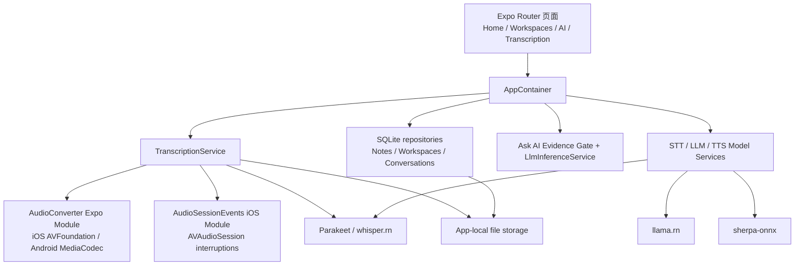
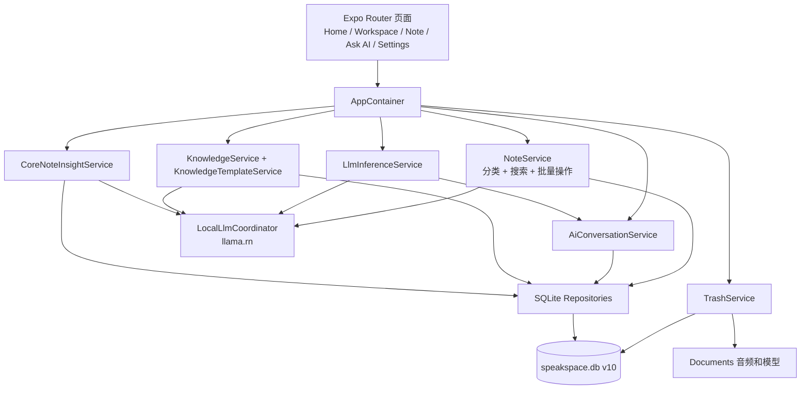
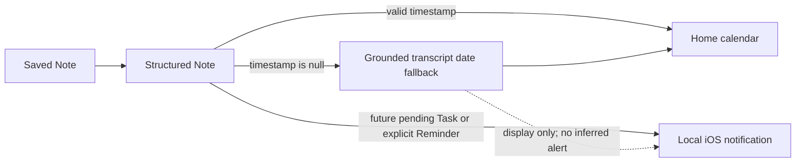

# SpeakSpace iPhone 端移植开发记录（YQ）

## 摘要

本阶段把已有的 SpeakSpace Android/Expo 手机项目扩展为可在 iPhone 上独立运行的本地优先应用。目标不是发布 App Store，也不包含 iPad 或 Mac 版本；重点是让录音转写、音频导入、Workspace、本地模型管理、TTS 和基于转录的 Ask AI 在 iPhone 真机上可用，并为没有 Mac、没有付费开发者账号的组员准备可由 SideStore 重新签名的 IPA。

最终交付不只是“能够编译”：代码中增加了 iOS 原生音频转换和音频中断模块、Whisper 中文模型路径、存储与时长保护、iPhone 安全区布局、可重复执行的 Release 检查、SideStore IPA 打包脚本和物理设备验收文档。

2026 年 8 月 23 日继续完成了一个独立的 iOS feature batch：把桌面端已有的外观偏好、首页完整 Task 操作，以及 Ask AI、Structured Note、Knowledge document 的本地语音朗读移植到 iPhone。语音朗读支持渐进合成、暂停、续播、切换内容时停止旧会话，以及进入后台或锁屏时自动暂停。

2026 年 8 月 24 日又完成了一轮桌面功能对齐：统一回收站、Note 批量操作、最多三篇 Note 的 Ask AI、自定义 Knowledge 模板与不可变历史、保存后自动分类、无 Embedding 的本地模糊搜索，以及可置顶的滚动周期 Task。实现继续复用共享领域层和 SQLite，没有增加云服务、Embedding 模型或 App Store 依赖；最终通过 Xcode 在连接的 iPhone 16 Pro Max 上执行完整 Release UI 验收。

2026 年 8 月 26 日完成第三轮 iOS 可用性补全：界面收敛为仅英语，新增首页日期兜底、本地任务和提醒通知、Note PDF 分享、保存后自动生成 Structured Note、首次使用引导、字号偏好、Note 关联 Ask AI、分阶段加载反馈、安全 Markdown、Ask AI 自动朗读和 Workspace 归类建议。同时为 Ask AI、Structured Note 和 Knowledge 建立端到端超时与可取消队列，避免本地模型排队或推理失败时丢失原始 Note。该批次保持 iPhone、本地优先和 Personal Team 安装边界，没有增加云服务或 App Store 发布依赖。

> Evidence:
> - Source: `modules/audio-converter/ios/`, `modules/audio-session-events/ios/`, `src/services/transcription-service.ts`, `src/database/migrations/ios-parity-schema-migration.ts`, `tests/ios-parity-features.test.mjs`, `scripts/verify-ios-release.mjs`, `scripts/package-ios-sidestore.mjs`
> - Method: 对照 `main` 基线审查所有新增与修改文件；在 iPhone 16 Pro Max 上构建、安装并执行核心流程和桌面功能对齐验收
> - Confidence: High；Windows + SideStore 的真实安装仍需要一名组员完成外部试装

## 一、项目约束和范围

### 1.1 已确认约束

- 只支持 iPhone 手机，不做 iPad 和 Mac 适配。
- 最低 iOS 版本设为 16.4，界面锁定竖屏。
- 不发布 App Store；开发阶段使用 Personal Team 真机安装，组员测试采用 SideStore 自签名。
- 录音、转录、笔记、Workspace、Ask AI 历史和模型保存在应用本地容器。
- 只有用户主动下载模型时需要网络；推理过程在设备上完成。
- 模型不打入 IPA，避免安装包过大，由每台设备分别下载。
- 中文是主要验收语言，因此加入多语言 Whisper 模型和中文 Ask AI 证据处理。

### 1.2 不在本阶段范围内

- App Store 上架、TestFlight、付费 Ad Hoc 分发。
- iCloud 或服务器同步。
- 后台持续录音或后台持续下载。
- iPad 分栏布局和 Mac Catalyst。

## 二、整体架构

项目继续使用 Expo Router、React Native 和本地服务层，没有为 iOS 复制一套业务代码。平台差异收敛在 Expo Modules 和配置层，页面仍调用统一的 `AppContainer` 服务。



这个结构的关键决定是：`ios/` 和 `android/` 保持 Expo Prebuild 生成并由 Git 忽略，必须长期保存的原生实现放在 `modules/`，构建修复放在可审计的 `postinstall` 脚本中。这样组员从干净仓库执行 `npm ci` 和 `npx expo prebuild` 时能够重建相同原生工程。

## 三、主要开发内容

### 3.1 iOS 音频导入与格式转换

Android 原版的 `AudioConverter` 只注册了 Android 平台，iPhone 无法处理导入文件。为此新增：

- `AudioConverterModule.swift`：向 JavaScript 暴露 `prepareAudioAsync`。
- `AudioPreparer.swift`：使用 AVFoundation 读取 WAV、MP3、M4A、AAC、FLAC 等系统可解码音频，转换为 16 kHz、单声道、16-bit PCM WAV。
- `AudioConverter.podspec` 和 `expo-module.config.json` 的 Apple 注册。
- 转换失败时删除临时文件，避免无效输出占用空间。
- 输入和输出两层两小时限制，防止元数据不可信时生成超长 WAV。

Android 端同步增加相同的两小时时长约束，避免跨平台规则不一致。

> Evidence:
> - Source: `modules/audio-converter/ios/AudioPreparer.swift`, `modules/audio-converter/android/src/main/java/expo/modules/audioconverter/AudioConverterModule.kt`, `src/domain/audio-import/audio-import.ts`
> - Method: 检查目标采样率、声道数、PCM 位深、时长检查和失败清理分支；Swift smoke test 覆盖短样本与超长输入
> - Confidence: High

### 3.2 录音生命周期、Finish 和系统中断

真机测试发现用户说完话后点击 Finish，最后一段语音可能尚未进入转写队列。修复后的顺序是先停止音频流并结算活动时长，再要求 transcriber 处理 `nextSlice()`，最后停止转写器并合并结果。空转录不会进入无法保存的弹窗，并提供带确认的丢弃出口。

iOS 来电、Siri、其他音频 App 和锁屏可能触发 AVAudioSession 中断。新增 `AudioSessionEvents` Expo Module，把系统中断事件送到 React Native 页面；页面将活动录音暂停并保留会话，不在返回前台时自动恢复，避免用户不知情地继续录音。

同时实现：

- 活动录音累计计时，暂停时间不计入两小时上限。
- 距离上限五分钟时提示。
- 到达两小时后自动暂停并进入可保存状态。
- 录音期间保持屏幕唤醒，离开活动状态时解除。

> Evidence:
> - Source: `src/services/transcription-service.ts`, `src/app/transcription.tsx`, `modules/audio-session-events/ios/AudioSessionEventsModule.swift`, `tests/live-transcription-finish.test.mjs`
> - Method: 检查 Finish 调用顺序、计时器清理、AppState 和 interruption 回调；在真机完成“录音—Finish—保存—重启”流程
> - Confidence: High

### 3.3 中文 STT 与 Whisper 原生稳定性

原领域模型只允许 `parakeet`。现在 `SttModelEngine` 同时支持 `parakeet` 和 `whisper`，模型目录新增 `Whisper Small Multilingual (F16)`，中文提示传给 whisper.rn，并在实时录音和音频导入两条路径统一选择引擎。

whisper.rn 0.7.2 的异步 JSI 任务会复制配置对象，但其中的 `language` 和 `initial_prompt` 指针仍可能指向移动前字符串。`scripts/patch-whisper-jsi-string-lifetimes.mjs` 在 `npm ci` 后重新绑定 `c_str()` 指针；脚本要求精确命中两个上游位置，依赖升级导致源代码变化时会主动失败，强制重新审查补丁，而不是静默修改未知版本。

> Evidence:
> - Source: `src/constants/stt-model-catalog.ts`, `src/domain/stt-model/stt-model.ts`, `src/services/stt-model-service.ts`, `src/services/transcription-service.ts`, `scripts/patch-whisper-jsi-string-lifetimes.mjs`, `tests/whisper-jsi-config-lifetime.test.mjs`
> - Method: 静态回归测试验证补丁锚点；真机下载并激活模型后完成中文录音转写
> - Confidence: High

### 3.4 模型下载和存储安全

STT、LLM 和 TTS 模型都可能达到数百 MB 或数 GB。新增 `ensureStorageAvailable()`，在下载、音频转换和保留原始录音前检查可用空间，同时保留 256 MB 安全余量。检查失败只返回可理解的错误，不自动删除用户的模型、录音、笔记或 Workspace。

模型下载统一使用 Expo FileSystem foreground session。应用离开前台时传输可能停止，但不会继续占用不可见的后台任务；用户回到模型页面后可以重新开始。下载完成后检查实际字节数，失败或大小不匹配时只清理本次临时文件。TTS 的压缩包在解压和模型检测完成后删除。

> Evidence:
> - Source: `src/services/storage-safety-service.ts`, `src/services/stt-model-service.ts`, `src/services/llm-model-service.ts`, `src/services/tts-model-service.ts`, `tests/model-download-session.test.mjs`
> - Method: 检查三个模型服务的 foreground session、字节校验和清理范围；自动测试防止退回后台下载器
> - Confidence: High

### 3.5 Ask AI 的中文证据约束

真机短会议转录测试中，Ask AI 返回“转录信息不足”，原因不是模型完全不可用，而是原证据分块和关键词处理偏向英文，中文连续文本没有形成足够稳定的检索 token。

解决方法：

- Unicode NFKC 归一化。
- CJK 字符和双字 token 提取，同时保留英文词干逻辑。
- 识别“这个笔记说了什么”“总结这份转录”等中文概述问题。
- 概述答案必须保留证据中的数字和时间原子；如果模型遗漏关键日期/时间，拒绝把不完整回答当成已验证结果。
- 证据门只允许基于选中转录回答，不将普通模型知识当作笔记内容。

> Evidence:
> - Source: `src/services/ask-ai-evidence-text.ts`, `src/services/ask-ai-evidence-gate.ts`, `src/services/llm-inference-service.ts`, `tests/ask-ai-chinese-grounding.test.mjs`
> - Method: 中文和英文概述问题单元测试；验证转录中的日期与时间不会被无声丢弃
> - Confidence: High；不同本地 LLM 的语言质量仍需持续真机抽样

### 3.6 iPhone 界面和安全区域

适配过程中出现三类明显布局问题：

1. 底部 Home、Workspaces、AI 使用占位三角形，并与 Home Indicator 重叠。
2. Save transcription 弹窗从顶部展开，与状态栏和灵动岛重叠。
3. New workspace 表单同样进入顶部状态栏。

底部导航在 iOS 使用 SF Symbols、在 Android/Web 使用对应的 Material Symbols：Home 使用四宫格、Workspaces 使用文件夹、AI 使用立方体，并用 `useSafeAreaInsets()` 计算底部高度。Expo 57 的 `SymbolView` 只接收 SF Symbol 字符串时不会在 Android 渲染，因此这里使用逐平台名称和字重映射。两个表单改为“全屏遮罩 + 安全区 viewport + 居中卡片”，键盘出现时在剩余可见区域内居中，内容过长仍可滚动。

> Evidence:
> - Source: `src/app/(tabs)/_layout.tsx`, `src/app/transcription.tsx`, `src/app/workspaces/index.tsx`, `tests/bottom-tab-bar.test.mjs`, `tests/live-transcription-finish.test.mjs`, `tests/workspace-create-modal-layout.test.mjs`
> - Method: iPhone 16 Pro Max 截图复现；代码检查 safe-area inset 和 centered viewport；回归测试锁定布局结构
> - Confidence: High

### 3.7 Release、Personal Team 和 SideStore

项目禁用了 llama.rn 可选的 Extended Virtual Addressing 和 Increased Memory Limit entitlement，因为免费 Personal Team 无法签发这些能力。`verify-ios-release.mjs` 检查：

- `UIDeviceFamily` 必须只有 iPhone。
- 最低系统版本不低于 16.4。
- 设备可执行文件必须是 arm64，不能混入模拟器架构。
- 必须内嵌 `main.jsbundle`，确保脱离 Metro 启动。
- Release 不声明后台音频、Bonjour 或应用自有的本地网络权限。
- Personal Team 安装包不得带有两个不可用的内存 entitlement。

Expo Dev Launcher 的 Release Info.plist 处理阶段曾可能早于最终 plist 生成。`patch-expo-dev-launcher-release-plist.mjs` 为该脚本增加 Info.plist 输入依赖，保证 Xcode 构建顺序稳定。

团队仓库使用中性 Bundle ID，`app.config.ts` 允许开发者通过 `IOS_BUNDLE_IDENTIFIER` 环境变量生成自己的本地工程，避免把个人 Team ID 写进 Git。`package-ios-sidestore.mjs` 从已验证 `.app` 复制应用，删除原签名和 provisioning profile，验证 `Payload/*.app` 结构并生成 SHA-256，供 Windows 测试者在 SideStore 中自行重签。

> Evidence:
> - Source: `app.json`, `app.config.ts`, `scripts/verify-ios-release.mjs`, `scripts/patch-expo-dev-launcher-release-plist.mjs`, `scripts/package-ios-sidestore.mjs`, `tests/ios-personal-team.test.mjs`, `tests/ios-release-verifier.test.mjs`, `tests/ios-sidestore-packager.test.mjs`
> - Method: Release 真机构建与 codesign 验证；IPA 解压检查并对照 SHA-256
> - Confidence: High for build/package structure; Medium for Windows installation until pilot tester completes SideStore import and refresh

## 四、开发期间遇到的问题与解决方法

| 问题 | 根因 | 解决方法 | 验证方式 |
| --- | --- | --- | --- |
| Xcode 提示 `.xcworkspace has disappeared` | `ios/` 是 Expo 生成目录，Prebuild/Pods 重建后旧 Xcode 窗口仍指向已替换的 workspace | 关闭旧 container，重新执行 Prebuild/Pod install，只打开 `.xcworkspace` | 新 workspace 能解析 Pods 并完成设备构建 |
| 真机签名失败或 Bundle ID 不可用 | Personal Team 只能注册属于该账号的 App ID，个人标识被写进团队配置会互相冲突 | 仓库保留团队中性 ID，本地用 `IOS_BUNDLE_IDENTIFIER` 覆盖，Xcode 自动签名 | `npx expo config` 同时验证默认值和环境覆盖值 |
| 点击 Finish 后最后一段语音丢失 | 最后一片音频仍在队列，停止顺序过早 | 停流后显式 `nextSlice()`，再停止 transcriber 并合并结果 | 真机短语音测试和 `live-transcription-finish` 回归测试 |
| iOS 无法导入 Android 已支持的音频格式 | Android MediaCodec 模块没有 Apple 实现 | 使用 AVFoundation 新增 iOS AudioConverter，统一输出 STT WAV | Swift smoke test和真机文件导入矩阵 |
| 锁屏/来电后录音状态不可信 | JS AppState 无法覆盖所有 AVAudioSession 中断 | 新增 AudioSessionEvents 原生模块并保持手动恢复 | 锁屏、前后台和系统音频中断验收表 |
| 中文 Ask AI 返回“信息不足” | 英文式分词使中文证据无法稳定命中 | CJK token、概述意图和数字原子完整性检查 | 中文会议转录问题和自动测试 |
| 模型下载失败后残留或存储不足 | 大文件下载、解压和模型同时存在，空间估算不足 | 操作前空间预算、foreground task、字节校验、局部临时文件清理 | 模型下载测试和低存储验收 |
| 弹窗与灵动岛/状态栏重叠 | 旧底部抽屉 `ScrollView` 在全屏透明 Modal 中从顶部扩展 | safe-area viewport 内居中卡片，KeyboardAvoidingView 处理键盘 | iPhone 截图与三个布局回归测试 |
| Android 底部图标在合并审阅中可能消失 | `expo-symbols` 仅收到 SF Symbol 字符串，Android 没有 Material Symbol 名称和字重 | 为三枚图标提供 iOS/Android/Web 映射和 Android 字重 | Expo 57 文档核对、类型检查和底部导航回归测试 |
| 免费签名不能使用 llama.rn 内存 entitlement | Apple Personal Team 不提供这两个可选 capability | 关闭 entitlement，选择适合手机内存的模型和上下文 | Release entitlement 检查和连续问答测试 |
| 原 `.app` 不能直接发给其他 iPhone | provisioning profile 绑定签名 Team 和设备 | Release 提供去除原签名的 IPA，由 SideStore 为每位组员重签 | IPA 结构检查；Windows 试装待完成 |

## 五、构建和验证方法

### 5.1 自动检查

```bash
npm ci
npm test
npx tsc --noEmit
npm run lint
npx expo-doctor
git diff --check
```

测试覆盖的关键回归包括：中文 Ask AI、底部导航与安全区、Finish 最后一片音频、居中保存弹窗、Personal Team entitlement、Release 元数据、模型前台下载、whisper.rn JSI 补丁和 SideStore 打包规则。

### 5.2 设备 Release

```bash
IOS_BUNDLE_IDENTIFIER=com.example.speakspace.local \
  npm run ios:device:release

npm run verify:ios-release -- \
  /absolute/path/to/speakspacelocalmobile.app \
  --require-signed
```

物理设备验收记录位于 `docs/ios-device-acceptance.md`。模拟器结果不能代替麦克风、签名、模型内存、系统音频中断和本地数据持久化的真机结论。

### 5.3 SideStore 产物

```bash
npm run package:ios:sidestore -- \
  /absolute/path/to/speakspacelocalmobile.app
```

输出 IPA 与 SHA-256 文件上传到 GitHub Release。Windows 组员执行 `docs/ios-sidestore-windows.md`，首位测试者必须记录安装、启动、模型下载、一次转写、一次 Ask AI 和一次签名刷新。

## 六、当前验证状态

- iPhone 16 Pro Max 真机 Release 构建、签名、覆盖安装和脱离 Metro 启动：已完成。
- STT、TTS 激活；中文短语音识别并保存到 Workspace：已完成。
- Save transcription、New workspace 和底部导航安全区修复：已在真机确认问题并安装修复版。
- Ask AI 中文证据处理：自动测试完成；不同会议样本仍建议扩大测试。
- 干净 Prebuild 后的 iPhone Release：`xcodebuild` 重新编译 139 个原生 target，结果为 `BUILD SUCCEEDED`；产物只包含 arm64、`UIDeviceFamily = [1]`、最低 iOS 16.4 和团队中性 Bundle ID。
- 自动质量门：2026-08-23 的当前分支为 30/30 测试通过，TypeScript 通过，Expo Doctor 21/21 通过，ESLint 为 0 error（17 个 warning），`git diff --check` 通过。
- SideStore IPA：32,828,985 bytes；不含签名、provisioning profile 或 `__MACOSX` 元数据；SHA-256 为 `95308e11392d881db71ca8e6c410bc9fea837b97d3558b8682704c1d5e4f32fa`。
- Windows + SideStore 实际安装与七天内 Refresh：待首位组员试装。这是分发链剩余的唯一外部设备验收项，不应被自动测试替代。
- 2026-08-24 桌面功能对齐批次：真机生产服务层 17/17 检查通过，Xcode/XCUITest 完整流程 1/1 通过，TypeScript 和 71/71 自动测试通过；最终数据库完整性为 `ok`，回收站和临时置顶状态均为 0。

## 七、已知限制和后续工作

1. 免费 SideStore 签名需要周期性刷新，无法做到永久的一键安装。
2. SideStore 本身和 SpeakSpace 会占用 Personal Team 的开发应用名额。
3. iOS 版本升级可能使 pairing file 失效，需要重新配置。
4. 所有用户数据只在设备本地；卸载应用会删除容器，当前没有自动导出/恢复功能。
5. 大模型能否连续运行受 iPhone 内存限制影响；不能通过免费签名开启额外内存 entitlement。
6. Whisper Small F16 适合中文验收，但约 488 MB；每位测试者需要单独下载。
7. 本阶段没有真实 Windows 环境，SideStore 指南基于官方流程和 IPA 结构；必须由组员完成一次 pilot test 后再宣布整个分发链通过。

## 八、可用于个人报告和团队报告的贡献要点

### 个人报告可展开

- 为什么采用“共享业务层 + 双平台 Expo Module”，而不是复制一套 iOS 页面。
- AVFoundation 音频转换的格式、采样率、声道和临时文件策略。
- 实时转写 Finish 顺序、系统中断和两小时时长状态机。
- whisper.rn JSI 字符串生命周期问题的定位和可重复补丁策略。
- 中文证据检索与数字/时间事实完整性约束。
- Personal Team、SideStore 和应用签名之间的边界。
- 安全区域问题如何从截图复现，再用代码结构测试防回归。

### 团队报告可展开

- Android 与 iPhone 共用领域模型、服务和 SQLite 仓储，平台差异集中到原生模块。
- 本地优先隐私设计：内容不上云，联网仅用于用户主动模型下载。
- 自动测试、Release 元数据验证、物理设备验收和 Windows 外部试装构成四层质量门。
- 不上架 App Store 条件下的分发权衡：免费但需七天刷新的 SideStore，与付费官方渠道之间的取舍。

## 九、2026-08-23 桌面功能移植与真机验收

### 9.1 需求选择与设计边界

本轮只处理 iPhone，不要求 Android 同步，也不增加 App Store 发布能力。移植内容来自桌面端已有工作流，范围固定为：

1. Light、Dark、System 三种全局 Theme preference。
2. Home 直接展示 Structured Note 生成的完整 Task，可完成、展开已完成项并恢复未完成。
3. Ask AI 助手回复、Structured Note 和 Knowledge document 的本地 TTS 朗读，以及暂停和续播。

Raw transcript、用户问题、界面文字朗读、语速和说话人设置没有进入本轮范围。三个实现决策分别记录在 `docs/adr/0003-use-resumable-progressive-tts-playback.md`、`docs/adr/0004-preserve-task-completion-across-regeneration.md` 和 `docs/adr/0005-serialize-local-inference-operations.md`。

### 9.2 Theme preference 开发过程

旧实现的 `useColorScheme()` 固定返回 Light，因此虽然颜色常量中已经存在 Dark token，界面仍无法进入深色模式。本轮新增 `ThemeProvider`，在 React 首次渲染前同步读取 `expo-sqlite/kv-store`，并把 `mode`、`preference` 和 `setPreference()` 暴露给全部页面。根布局主动保持 Splash，主题解析完成后再隐藏，避免启动时先闪出浅色页面。

Settings 成为第四个底部 Tab。用户选择会先更新界面，再写入本地存储；写入失败时回滚到原值并显示错误。`app.json` 同时改为自动外观并为 Splash 提供深色背景，使原生启动画面和 React 页面保持一致。

> Evidence:
> - Source: `src/providers/theme-provider.tsx`, `src/app/(tabs)/settings.tsx`, `src/app/_layout.tsx`, `src/hooks/use-theme.ts`, `app.json`
> - Method: 检查同步读取、失败回滚和 Splash 生命周期；在 Reference iPhone 上依次选择 Dark、System，再恢复测试前偏好
> - Confidence: High

### 9.3 Home Task List 开发过程

原 Home/Dashboard 数据查询只返回 Task ID、Note ID 和状态，足够计数但不足以渲染可操作列表。本轮让 repository 返回完整 `CoreTask`，Home 按 due time 优先、start time 次优的规则分为 Overdue、Today、Upcoming 和 Unscheduled；Completed 单独折叠显示，Cancelled 不出现在 Home。

勾选操作直接调用 Structured Note repository 的状态更新，成功后重新加载 Home。点击 Task 内容会打开来源 Note。为了避免用户完成的 Task 在重新生成 Structured Note 后丢失，repository 使用“规范化标题 + 有效日期”匹配旧 Task，只把精确匹配项的完成时间带到新结果，不做模糊匹配。

开发期间删除了隐藏的独立 Dashboard 页面，把概览、Task、Note 和 Calendar 保留在唯一 Home 页面，减少手机端重复导航。

> Evidence:
> - Source: `src/components/home-task-list.tsx`, `src/app/(tabs)/index.tsx`, `src/services/home-task-groups.ts`, `src/services/core-task-identity.ts`, `src/repositories/core-note-insight-repository.ts`
> - Method: 单元测试覆盖分组和 Task identity；真机从 Home 完成 Task，确认 SQLite 状态变为 `completed`，再从 Completed 展开并恢复为 `pending`
> - Confidence: High

### 9.4 渐进式 TTS 开发过程

TTS 模型页面原本只有下载、激活和模型检测，没有生成音频或播放入口。本轮新增全局 `SpeechPlaybackService`：

- 按自然标点把长文本分成目标约 240 字、最多 360 字的片段。
- 第一段完成后立即使用 `expo-audio` 播放，后续片段继续合成，不等待全文结束。
- 暂停时保留当前播放器位置和已经生成的片段，不启动新的片段合成；续播从原位置继续。
- 全应用同一时间只保留一个 Speech playback session；朗读另一项内容时清理旧播放器、TTS engine 和临时 WAV。
- 进入后台或锁屏时自动暂停，返回前台后必须由用户手动续播。
- 启动时删除上次异常退出可能遗留的 speech playback cache。

`LocalLlmCoordinator` 的范围从 LLM 扩展到 transcription 和 TTS 协调。开始录音、文件转录或本地 LLM 生成前会停止正在播放的语音，避免模型同时占用手机内存，也避免扬声器反馈进入麦克风。TTS 模型路径改为相对 Documents 保存，解决 iOS 更新或覆盖安装后应用容器 UUID 改变导致绝对路径失效的问题。

页面层使用一个共享 `SpeechPlaybackButton`，目前接入 Ask AI assistant message、Structured Note 和 Knowledge document。没有 Active model 时会明确提示并提供 TTS Models 入口。

> Evidence:
> - Source: `src/services/speech-playback-service.ts`, `src/services/speech-text-chunks.ts`, `src/components/speech-playback-button.tsx`, `src/services/local-llm-coordinator.ts`, `src/services/sandbox-document-path.ts`, `src/services/tts-model-service.ts`
> - Method: 自动测试覆盖分块、FIFO 和容器路径迁移；Reference iPhone 使用 AISHELL3 Chinese 完成真实合成、播放、暂停保持和续播
> - Confidence: High

### 9.5 真机测试样本与执行方法

真机为 iPhone 16 Pro Max，系统 iOS 27.0，使用 Xcode 26.6 和 Personal Team 本地签名。测试前先备份应用 Documents/SQLite；测试数据库原本为空，因此写入一组只带 `Codex QA` 前缀的 Workspace、Note、Structured Note 和 pending Task。语音样本使用一段说明主题、Task 和 TTS 验收目标的中文长摘要，保证播放时间足以验证暂停位置。

本地生成的 `ios/SpeakSpaceDeviceUITests` XCUITest Target 被 `/ios` ignore 规则排除，不进入 Git。测试动作依次为：

1. 启动并确认 Home 显示 1 个 Note 和 1 个 open Task。
2. 选择 Dark，再选择 System。
3. 完成 Task，展开 Completed，恢复为 pending。
4. 下载约 30 MB 的 AISHELL3 Chinese，完成解压、检测和激活。
5. 从 Workspaces 打开测试 Note 和 Structured Note。
6. 等待状态从 Preparing 进入 Playing，点击 Pause，确认 Paused 状态保持 3 秒，再点击 Resume 并确认重新进入 Playing。
7. 返回 Settings，恢复测试开始前的 Theme preference。

完整真机用例在 68.525 秒内通过，Xcode 结果为 `TEST SUCCEEDED`。随后还原测试前 Documents，卸载 XCUITest Runner，并在干净数据库上执行启动用例；两次 UI configuration 启动分别在 5.868 秒和 3.232 秒内通过。

### 9.6 数据清理与验收结果

测试结束后没有把测试模型或样本留在手机：

- `workspaces`、`notes`、`core_note_insights`、`core_note_tasks`、`tts_models` 均恢复为 0 条。
- `Codex QA` 残留查询为 0。
- SQLite `PRAGMA integrity_check` 返回 `ok`。
- 临时 sherpa-onnx TTS model directory 已从 Documents 移除。
- 原 Theme preference 恢复为 System。
- 正式测试包仍保留在手机，XCUITest Runner 已卸载。

同一提交范围的 `npm test` 结果为 30 passed、0 failed。Node 对 TypeScript ESM 动态导入给出 `MODULE_TYPELESS_PACKAGE_JSON` 性能提示，但不影响测试正确性；该提示不是本轮功能阻塞项。

设备 Release 产物也通过 `verify-ios-release --require-signed`：最低系统版本为 iOS 16.4、设备族仅 iPhone、可执行文件为 arm64、内嵌 JavaScript bundle 存在且签名有效。验证器保留一条 Expo 生成 ATS dictionary 的审计提示；应用没有声明 Bonjour 或 Local Network privacy key，本轮新增网络访问仍只用于用户主动发起的模型下载。

> Evidence:
> - Source: `tests/ios-feature-batch.test.mjs`, Xcode `.xcresult`, 设备应用容器 SQLite 和测试命令日志
> - Method: XCUITest 真实触控与状态断言；测试后重新复制手机 Documents 并执行表计数、前缀残留查询和 SQLite integrity check
> - Confidence: High；结论覆盖本轮三个功能，不替代 `docs/ios-device-acceptance.md` 中尚未逐项填写的完整 STT、长时录音和 Windows SideStore 验收矩阵

### 9.7 iOS v1.1.0 稳定版封版

本轮功能验收完成后，把应用版本提升为 `1.1.0`、iOS build number 提升为 `2`，并以团队中性 Bundle ID 重新执行 Expo prebuild、CocoaPods 安装和完整 iPhoneOS Release 编译。公开 IPA 使用 `CODE_SIGNING_ALLOWED=NO` 生成中性 `.app`，随后由项目打包器去除所有残余签名材料；真机验收另用个人 Team 对同一源码生成签名 Release，避免在公开制品中写入个人 Team ID。

干净安装依赖时发现 `llama.rn` 的原生制品下载脚本被 `--ignore-scripts` 跳过，导致 Pods 工程找不到 `rnllama/rn-llama.h`。恢复该包声明的 postinstall 后，下载内容按包内清单 SHA-256 `ae9a37ae15a9e8d6ef0330f4afa3d8199af3590f7ecf371bfe48b35fd946c4ae` 验证，再重新生成 Pods，原始构建错误不再复现。此次修复不修改应用业务代码或 `llama.rn` 版本。

发布资产为 `SpeakSpace-iOS-v1.1.0.ipa`，大小 33,759,216 bytes，SHA-256 为 `565b3893b0681fe80c54e2fc9e877424c99c93591c3890f82ad21cf7dc060df8`。包内版本为 `1.1.0 (2)`，最低 iOS 16.4，设备族仅 iPhone，可执行文件仅 arm64，包含 4,334,861-byte 的离线 JavaScript bundle，不包含 `_CodeSignature`、`embedded.mobileprovision`、其他 provisioning profile 或 `__MACOSX` 元数据。

发布前还把 React Native 锁定的 Metro `0.84.4` 补丁更新为同系列 `0.84.5`，消除了 `image-size` 带来的 4 个 high severity 构建链公告；没有执行会降级 Expo 的 `npm audit fix --force`。旧 `ios-v1.0.0` Release 保留为回滚包，最新版使用独立的 `ios-v1.1.0` 标签和资产，避免覆盖已发布制品。

封版真机复核使用连接的 iPhone 16 Pro Max（iOS 27.0）：个人签名 Release 通过 `verify-ios-release --require-signed` 和 `codesign --verify --deep --strict`，随后以相同 Bundle ID 覆盖安装。设备应用清单显示版本 `1.1.0`、build `2`，`devicectl` 冷启动成功，复查时新进程仍在运行；未卸载应用，也未主动清除已有容器数据。功能批次在版本封板前已经完成主题、Task、TTS 合成及暂停/续播的 XCUITest 真机验收，本次复核用于确认最终版本元数据、签名产物、安装和脱离 Metro 启动链路。

## 十、2026-08-24 Ask AI、编辑弹窗与 Structured Note 稳定化

### 10.1 Ask AI 根因与修复

用户提供的失败样本中，当前笔记明明包含“小王负责 iOS 开发”和项目日期，助手仍返回“当前所选笔记没有足够的信息”。排查确认问题不在笔记选择：页面展示的 Based on 标题和传入 transcript 一致，误判来自回答链路在本地模型完成后又执行了一次过严的可回答性判断。中文短问题、口语化“干什么”、名字与职责的组合容易被第二次判断拒绝，使模型已经找到的证据无法进入最终回复。

本轮把当前锁定笔记的 transcript 继续作为唯一事实边界，但将“是否存在证据”和“如何组织回答”拆开：证据层补充中英文人物、职责、日期、截止时间和指代匹配；决策层优先返回经过 transcript 校验的直接证据，不再让一个独立的模型式否决步骤覆盖确定性证据。LLM 仍只负责在已验证证据范围内组织自然语言，证据为空时才返回信息不足。

同时保留 `2048` context、`512` generation reserve 和 90 秒硬截止。这里没有单纯无限提高 token：Ask AI 的典型回答很短，继续增大输出预算会让 1.5B 本地模型变慢并增加 iPhone 内存压力，不能解决错误的证据门控。页面在 queued 和 generating 阶段显示 spinner；问题、回复、当前 Note context 和会话状态写入 SQLite，离开页面后可以恢复，New 会显式创建新的 context-locked 会话。

> Evidence:
> - Source: `src/services/ask-ai-evidence-gate.ts`, `src/services/ask-ai-evidence-decision.ts`, `src/services/ask-ai-evidence-text.ts`, `src/services/llm-inference-service.ts`, `src/services/ai-conversation-service.ts`, `src/repositories/ai-conversation-repository.ts`, `src/app/ask-ai.tsx`
> - Method: 中英文职责、日期、截止时间、反事实问题、会话恢复和 90 秒 deadline 自动测试；iPhone 保留重新准备的中英文笔记供最终人工验收
> - Confidence: High

### 10.2 全局安全区域编辑弹窗

旧页面各自直接使用 React Native `Modal`，有的按底部 sheet 布局，有的依赖固定 padding。iOS 状态栏、刘海、安全区和键盘高度变化时，Move note 等短弹窗可能从屏幕最上方开始绘制，覆盖时间和状态图标。逐页增加 top margin 不能防止以后新增页面再次出现同类问题。

新增 `SafeAreaModal` 作为应用唯一的阻塞式编辑弹窗入口。iOS 一律在“当前可见安全区域”内垂直和水平居中，顶部和底部 padding 由 `useSafeAreaInsets()` 计算；内容过高时内部滚动，键盘出现时通过 `KeyboardAvoidingView` 调整。Android 仍可由页面选择 center 或 sheet，但不属于本轮验收范围。Workspace 新建/重命名、Note 新建/重命名/移动、Ask AI history/model picker、音频保存和转写结束弹窗已经统一迁移。回归测试会扫描这些页面，禁止再次绕过组件直接引入 `Modal`。

> Evidence:
> - Source: `src/components/safe-area-modal.tsx`, `src/app/workspaces/index.tsx`, `src/app/workspaces/[workspaceId]/index.tsx`, `src/app/notes/[noteId].tsx`, `src/app/ask-ai.tsx`, `src/app/audio-transcription.tsx`, `src/app/transcription.tsx`
> - Method: 静态回归测试覆盖所有编辑入口和 Move note；iPhone 真机检查状态栏安全区、居中位置、长内容滚动和键盘避让
> - Confidence: High

### 10.3 Structured Note 截断根因与恢复策略

Insights 页面出现 `The local model returned an unreadable result` 时，设备日志显示模型正好碰到旧的 `1152` completion 上限，JSON 在数组中途停止，解析器收到的并不是完整对象。只把上限调大可以降低单个样本的失败率，但较长笔记仍可能再次触顶，而且会增加生成时间和峰值内存，因此本轮同时调整输出预算和输入形态。

内容和 intent 的常规输出预算提高为 `1536` tokens，恢复模式为 `2304`，总 context 为 `6144`。生成器读取 `stopped_limit`、`context_full`、`truncated`、`tokens_predicted` 和 `stopped_eos`，只有找到闭合的首个 JSON object 才解析。Intent transcript 最多按 6 个子句、1100 个字符分批；某批触顶或 JSON 无效时先使用最小 JSON 的扩大预算重试，再二分证据窗口。模型最终仍失败时，摘要和显式任务、提醒、日程使用 transcript 驱动的确定性降级，不再让整个 Structured Note 空白。合并前还会清除无 transcript 支持、已完成或否定表达产生的伪待办，并补齐模型漏掉的明确 intent。

日期层补充英文月份、`14:30` 等 24 小时制、相对小时和更多中英文表达；所有推断同时记录设备本地 reference time 和 timezone，避免把运行当天日期误当成笔记事实。

> Evidence:
> - Source: `src/services/core-note-insight-service.ts`, `src/services/core-note-insight-generation-policy.ts`, `src/services/core-note-time.ts`
> - Method: 输出上限信号、闭合 JSON、16 子句分批合并、递归重试、确定性 fallback、中英文时间和普通叙述不生成假任务的自动测试；iPhone 上分别执行普通、密集和清理用例
> - Confidence: High

### 10.4 真机定向验收与数据状态

Reference iPhone 为 iPhone 16 Pro Max（iOS 27.0）。Ask AI 和 Structured Note 修复阶段保留了 3 篇全新的测试笔记：`YQ Fresh Chinese Demo`、`YQ Fresh Coffee Notes` 和 `YQ Fresh Harbor Plan`，覆盖中文职责/日期、英文普通叙述以及英文任务/提醒/日程。Structured Note 真机结果文件分别记录 2 个普通与多项用例、1 个密集用例和 1 个清理用例通过；Ask AI 最终的中英文直接证据分支由自动回归覆盖，3 篇笔记继续保留给用户做发布后人工验收。这些结果不冒充完整录音和 SideStore 验收矩阵。

封版后使用相同 Bundle ID 覆盖安装签名的 `1.2.0 (3)` Release。`devicectl` 确认设备仅保留主应用，没有 XCUITest Runner；应用脱离 Metro 启动且进程存活。覆盖安装没有删除本地 Qwen 2.5 1.5B Q4_K_M 模型或 3 篇测试笔记，复制出的 `speakspace.db` 执行 `PRAGMA integrity_check` 返回 `ok`。

### 10.5 iOS v1.2.0 稳定版封版

应用版本提升为 `1.2.0`，iOS build number 提升为 `3`。公开 SideStore IPA 来自中性、未签名的完整 iPhoneOS Release，真机安装包来自同一源码的个人开发签名 Release；公开资产不包含个人证书、Team ID、provisioning profile 或原始 `_CodeSignature`。

发布资产 `SpeakSpace-iOS-v1.2.0.ipa` 大小为 33,781,462 bytes，SHA-256 为 `e56c2ed5b4cf643cb515eb4d1cf1b51ee44a82eb068a8b1bae6bd083588e6061`。包内版本为 `1.2.0 (3)`，最低 iOS 16.4、设备族仅 iPhone、架构仅 arm64，离线 JavaScript bundle 为 4,390,559 bytes。ZIP 完整性检查通过，旧 `ios-v1.1.0` Release 保留为回滚包。

最终质量门为 60 passed、0 failed；`tsc --noEmit`、quiet Lint、`git diff --check` 均通过，Expo Doctor 为 21/21。`npm audit --omit=dev --audit-level=high` 没有 high 或 critical 漏洞，但保留 12 个来自 Expo CLI/Xcode 工具链间接依赖 `uuid` 的 moderate 公告；npm 提议的全量修复会把 Expo 57 降级到 Expo 46，因此没有执行 `npm audit fix --force`。这些公告不来自应用运行时新增代码，后续随 Expo SDK 兼容更新处理。

## 十一、2026-08-24 桌面核心功能对齐

### 11.1 范围确认与移植策略

本轮只开发和验收 iPhone，不同步修改 Android，也不增加 App Store 发布能力。需求确认阶段先对照桌面端已经稳定的交互和数据规则，再决定哪些规则直接复用、哪些按手机资源和屏幕空间简化。最终范围如下：

| 功能 | 沿用的桌面语义 | iPhone 端实现差异及原因 |
| --- | --- | --- |
| Trash | 删除先进入回收站，可恢复或永久删除 | 四类用户内容集中到 Settings；首版只提供逐项恢复和永久删除，避免小屏批量确认过于复杂 |
| Note 批量操作 | 批量移动、删除、置顶 | 同一数据库事务完成；选择期间冻结当前筛选结果，避免列表变化导致误操作 |
| 多 Note Ask AI | 从多篇笔记取证 | 限制为 1–3 篇，按 Note 均衡取证；不显示来源列表，内容较大时尽量给出有边界的回答 |
| Knowledge 模板 | 用户可定义提取结构 | 本地模型只生成草稿，用户确认 2–8 个 section 后才保存；模型不可用时可手工构建 |
| Knowledge 历史 | 保留生成结果 | 每次生成新增不可变快照；模板删除后旧结果仍可读 |
| Note 分类 | 保存后自动分类并允许人工调整 | 使用五个业务分类和 `uncategorized`；不为开发期旧数据执行后台回填 |
| Search | 从 Note 内容定位信息 | 不安装 Embedding 模型，使用关键词、有限编辑距离和确定性排序 |
| Task | 置顶和周期任务 | 只支持五种明确周期，每个系列只保留最近一个 pending occurrence，避免一次生成大量未来记录 |

桌面代码主要作为业务规则参考，没有直接复制 Electron/Ollama 的存储和推理实现。手机端仍通过 `AppContainer` 组装 Service 和 Repository，本地推理统一经过 `LocalLlmCoordinator`，数据继续保存在应用容器内的 SQLite 和 Documents。这样新增功能不会建立第二套 iOS 专用业务层，也不会破坏原有本地优先边界。

> Evidence:
> - Source: `docs/adr/0007-use-unified-trash-for-user-content.md` 至 `docs/adr/0015-apply-batch-note-actions-atomically.md`, `src/application/app-container.ts`
> - Method: 逐项对照桌面工作流、用户确认结果和 iPhone 资源限制，再把决定落实到独立 ADR 和共享服务边界
> - Confidence: High

### 11.2 数据库迁移和模块关系

数据库版本从 9 提升到 10，由 `IosParitySchemaMigration` 一次加入本轮需要的持久化字段：

- `workspaces`、`notes`、`ai_conversations`、`knowledge_templates` 增加 `trashed_at`，并为活动列表和 Trash 查询建立索引。
- `notes` 增加固定 `category`，默认值为 `uncategorized`。
- `knowledge_templates` 增加 `sections_json`；新建 `knowledge_results` 保存模板名称、section 快照、模型和删除标记。
- `core_note_tasks` 增加置顶时间、周期类型、周期参数、series key、occurrence index、当前 occurrence 和 series 结束时间。
- 如果开发数据库仍有旧 `knowledge_documents` 行，迁移会把它们复制为第一批不可变 `knowledge_results`，避免升级时无声丢失结果。



页面不直接拼装跨表 SQL。`AppContainer` 负责创建 Repository、分类器、模板服务、Trash 服务和推理协调器；Service 负责业务校验，Repository 负责过滤 `trashed_at`、事务和领域对象映射。这个分层使同一套规则可同时被页面、Node 回归测试和一次性真机验收驱动。

> Evidence:
> - Source: `src/database/migrations/ios-parity-schema-migration.ts`, `src/database/index.ts`, `src/application/app-container.ts`
> - Method: 检查 schema version、索引、迁移顺序、外键和每个 Service 的依赖注入关系
> - Confidence: High

### 11.3 统一 Trash 与原子批量操作

旧 iOS 实现会立即删除 Note 的数据库记录和音频。本轮改为 soft delete：普通删除只写入 `trashed_at`，所有活动 Workspace、Note、Ask AI conversation 和 custom template 查询默认排除该行。Settings 中新增统一 Trash 页面，使用与桌面端相同的线框废纸篓图标，可按 All、Notes、Workspaces、Ask AI 和 Templates 过滤并搜索。

移动到 Trash 后，全局 `TrashUndoProvider` 显示五秒 Undo。单次批量删除对应一次 Undo，请求恢复时仍以整个 ID 集合为单位。永久删除先计算影响范围并确认：删除 Note 或 Workspace 会在独占事务内清理关联 Knowledge、Structured Note、Task 和所有引用受影响 Note 的 Ask AI conversation；事务提交后再删除 Note 音频。音频清理失败只记录明确警告，不会把已经提交的数据库删除伪装成失败。永久删除 custom template 不删除已生成的 Knowledge result，而是清空 template 外键并写入 `template_deleted = 1`。

Home、Workspace detail 和 Search 共用 `NoteSelectionToolbar`。长按进入 selection mode 后，当前搜索词、分类和列表范围被冻结；Move、Trash、Pin All/Unpin All 分别调用 Repository 的 `withExclusiveTransactionAsync`，任何一条失败都会回滚整批。Note ID 不改变，因此移动 Workspace 不会打断音频、Knowledge、Task 或 Ask AI 关系。

> Evidence:
> - Source: `src/services/trash-service.ts`, `src/providers/trash-undo-provider.tsx`, `src/app/trash.tsx`, `src/components/note-selection-toolbar.tsx`, `src/repositories/note-repository.ts`
> - Method: 自动测试检查四类 Trash、恢复刷新和批量事务；真机执行批量移动、置顶/取消置顶、Trash、恢复和永久级联删除
> - Confidence: High

### 11.4 最多三篇 Note 的 Ask AI

数据库原有 `conversation_contexts` 已能关联多篇 Note，缺口主要在 UI 和首次会话创建。新 selection toolbar 允许选择 1–3 篇 Note；超过三篇时 Ask AI 按钮保持禁用并显示 `Select up to 3 notes`，不会静默截断用户选择。会话使用排序无关的精确 source set 恢复：只有来源集合完全一致时才恢复最近会话，单 Note 会话不会误接到多 Note 历史，New 则显式创建相同 source set 的新会话。

取证仍以所选 transcript 为事实边界，不加入 Embedding。针对具体问题按关键词和有限模糊匹配选最高相关片段；针对总结类问题按 Note 均衡分配上下文，避免第一篇长 Note 吃掉全部预算。如果全部内容无法放入 context，系统优先生成带边界的 best-effort answer，而不是仅因内容多就拒绝回答。只有所选材料确实没有相关证据时才返回信息不足。手机聊天页面不显示来源 Note、source chip 或逐句 citation，以保持界面简洁。

当任意来源 Note 或其 Workspace 在 Trash 中时，会话历史仍可阅读，但新提问和 Retry 被锁定；来源恢复后可继续。永久删除任一来源时，整个关联 conversation 一并删除，避免留下无法解释的数据引用。

> Evidence:
> - Source: `src/app/ask-ai.tsx`, `src/services/ai-conversation-service.ts`, `src/services/ask-ai-evidence-gate.ts`, `src/repositories/ai-conversation-repository.ts`, `tests/ask-ai-reliability.test.mjs`
> - Method: 自动测试覆盖三篇限制、精确 source set 恢复和大内容 best-effort；真机使用三篇不同类别 Note 生成 241 字符回答，并验证来源进入 Trash 后锁定、恢复后解锁
> - Confidence: High；回答语言质量仍受当前 1.5B 本地模型能力影响

### 11.5 自定义 Knowledge 模板与不可变历史

AI Management 增加 Custom templates 入口，Note 的 Knowledge picker 同时展示六个只读 built-in scenario 和用户模板。新建模板时输入名称与自然语言需求，活动本地模型将需求整理为 2–8 个 section 草稿；用户可修改 section 名称和 extraction guidance、增删 section，再明确保存。如果本地模型不可用或草稿生成失败，名称和需求不会丢失，用户可以 Retry 或从两个空 section 开始手工构建。

原 `knowledge_documents` 采用“每个 Note 覆盖一行”的方式，无法证明多次生成的变化。本轮 `KnowledgeService` 每次成功都向 `knowledge_results` 插入新快照，保存当时模板名称、section 结构、内容、model ID 和时间；失败或取消不写历史。Note detail 默认展开最新结果，旧结果折叠显示，用户可以单独永久删除一条结果。编辑或删除模板只影响以后生成，不改写历史结果；永久删除 Note 才级联删除其全部 Knowledge 历史。

> Evidence:
> - Source: `src/app/(tabs)/ai/knowledge-templates.tsx`, `src/services/knowledge-template-service.ts`, `src/services/knowledge-service.ts`, `src/repositories/knowledge-template-repository.ts`, `src/repositories/knowledge-document-repository.ts`
> - Method: 真机创建并编辑 `QA Decision Review` 两 section 模板，生成历史后删除模板，确认快照仍可读且带 deleted-template 状态
> - Confidence: High

### 11.6 自动分类与无 Embedding 模糊搜索

Note 分类固定为 `meeting`、`personal`、`idea`、`learning`、`general` 和 `uncategorized`。新建 Note 或保存 transcript 后，`NoteService` 先完成数据库写入，再非阻塞调用 `NoteClassificationService`；分类 prompt 最多读取 1200 个字符，只接受恰好一个合法 category key。成功后更新数据库并通过订阅事件刷新已挂载页面，失败则保留当前值。用户可在 Note detail 手工修改或重新触发自动分类；按照本轮确认的“自动优先”原则，下一次 transcript 保存后的自动结果可以覆盖之前的人工值。Rename、Move 和 Pin 等 metadata 操作不会触发分类。

搜索没有移植桌面 Ollama Embedding，也没有模型下载、向量表、内容哈希或后台索引。Repository 动态构建 Note-owned corpus，包含标题、完整 transcript、category、Structured Note 和 Knowledge result，不包含 Ask AI 对话。排序优先级依次为标题完整短语、标题全部词、其他字段完整短语、同一 Note 内分散命中、有限模糊命中；短 query 最多允许一次字符编辑，较长 query 最多两次。相同分数再按 Note 置顶和更新时间排序。UI 在约 200 ms 防抖后刷新，只显示最高相关 excerpt 和 Title、Transcript、Structured Note 或 Knowledge 来源类型，不显示容易误导的相似度百分比。

> Evidence:
> - Source: `src/constants/note-categories.ts`, `src/services/note-classification-service.ts`, `src/services/note-fuzzy-search.ts`, `src/repositories/note-repository.ts`, `src/app/notes/search.tsx`
> - Method: 真机保存四篇不同用途 Note 并核对自动分类；使用错拼 `phalaenopsys` 命中包含 `phalaenopsis` 的 research Note，再验证人工分类覆盖和分类筛选
> - Confidence: High for deterministic matching and tested samples; 不是语义向量检索，完全换词的概念查询可能不命中

### 11.7 Task 置顶和滚动周期

Structured Note 只接受 transcript 中明确出现的 `daily`、`weekdays`、`weekly`、`biweekly` 和 `monthly` 五种周期。生成前，确定性规则给中英文周期短语补上 first date 与 `REPEAT` annotation，帮助小模型保持日期和规则；保存前再次检查原 transcript 证据，模型自行猜测的周期不会进入数据库。

周期 Task 通过规范化标题、Note ID、recurrence kind 和日期参数形成稳定 series key。首版不预生成未来 90 或 365 天记录，只持久化最近一个 pending occurrence。完成当前 occurrence 后，Repository 在同一事务内保留 completed history，并创建严格晚于完成时间的下一个 occurrence：weekdays 跳过周末，错过的日期不补建，月度日期在某月不存在时跳到下一个有效月份。只允许恢复系列中最近一次完成记录；恢复时，如果自动生成的 successor 仍为 pending，则先删除 successor，再重新打开该记录。

Task pin 保存在系列状态上，后续 successor 自动继承。Home 的 Overdue、Today、Upcoming 和 Unscheduled 分组仍优先，置顶只改变同组内部顺序；Completed 继续折叠并分页显示。重新生成 Structured Note 时，精确匹配的系列保留 history、当前 occurrence 和 pin，消失或改变规则的旧系列标记结束，不把历史错误转移到新系列。

> Evidence:
> - Source: `src/services/task-recurrence.ts`, `src/services/core-note-insight-service.ts`, `src/repositories/core-note-insight-repository.ts`, `src/components/home-task-list.tsx`, `tests/ios-parity-features.test.mjs`
> - Method: 自动测试覆盖中英文周期、缺失月日期、错过日期和 regeneration；真机完成、生成 successor、恢复并置顶/取消置顶 weekly 与 weekdays Task
> - Confidence: High

### 11.8 真机样本、Xcode 验收和清理

本轮没有使用 iPhone Mirroring，因为 Mac 的系统版本低于手机系统，镜像链路无法建立。测试只使用 Xcode、`xcodebuild`、XCUITest 和 `xcrun devicectl` 操作已连接的 `ip16pm`。测试前删除手机上旧的开发样本，但保留 Documents 中的 Qwen 2.5 1.5B Q4_K_M 模型；随后创建以下独立样本：

| 样本 | 用途 |
| --- | --- |
| `QA Atlas Weekly Meeting` | Meeting 分类、明确截止任务、每周周期 |
| `QA Privacy Research Memo` | Learning 分类、错拼 `phalaenopsys` 模糊搜索 |
| `QA Personal Weekend Plan` | Personal 分类、三 Note Ask AI 来源 |
| `QA Offline Product Idea` | Idea 分类、批量移动和置顶 |
| `QA Full Coverage`, `QA Move Target` | Workspace Trash、恢复和跨 Workspace 批量移动 |
| `QA Decision Review` | 两 section 自定义模板、编辑、Trash 和历史保留 |

先通过一次性真机生产服务验收执行 17 个状态转换，覆盖四类 Trash、永久级联、批量事务、分类、搜索、Knowledge、Task recurrence 和三 Note Ask AI，结果为 17 passed、0 failed。该临时入口在验收后从源码移除，避免正式 App 保留测试后门。随后在 Xcode Release 配置下执行一条端到端 XCUITest，真实点击 Home、Search、selection toolbar、Ask AI、Settings Trash、template editor、category filter、Note Task 和 Knowledge history；首次完整流程 1/1 通过并保留 8 张 Xcode attachment。

提交前使用最新 Expo Doctor 复查 SDK 57 兼容性时，发现 7 个 Expo 包各落后官方推荐版本一个 patch。按照 Expo CLI 的版本对齐流程执行 `npx expo install --fix`，再用 CocoaPods 同步 `ExpoModulesCore` 与 `ExpoModulesWorklets` 后，重新构建、签名、安装 Release 包并从头执行相同 XCUITest。最终一轮耗时 140.056 秒，1/1 通过；这避免把“JavaScript 测试通过但原生 Pods 仍停留在旧 patch”的状态推送给组员。

XCUITest 完成后再次复制真机 SQLite。最终状态为 4 Notes、2 Workspaces、1 个含 3 context/2 message 的 conversation、1 template、1 Knowledge result 和 3 Tasks；Trash 为 0，Note/Task pin 为 0，`PRAGMA integrity_check` 返回 `ok`，`PRAGMA foreign_key_check` 无记录。正式 App 已重新启动并保持运行。测试前生成的约 970 MB 临时容器备份在确认最终状态后永久清理，手机上的 Qwen 模型和新验收样本不受影响。

```bash
npx tsc --noEmit
npm test -- --runInBand
npm run lint
npx expo install --check
npx expo-doctor
git diff --check

xcodebuild \
  -workspace ios/speakspacelocalmobile.xcworkspace \
  -scheme speakspacelocalmobile \
  -configuration Release \
  -destination 'platform=iOS,id=<DEVICE_UDID>' \
  -only-testing:speakspacelocalmobileTests/SpeakSpaceDeviceAcceptanceTests/testFullSeededFeatureWorkflowOnPhysicalDevice \
  -allowProvisioningUpdates test
```

最终自动质量门为 71 passed、0 failed；TypeScript 通过，Expo Doctor 为 21/21，Expo 依赖检查无待更新项，Lint 为 0 error、16 warnings，`git diff --check` 和 Xcode project file 语法检查通过。`npm audit --omit=dev --audit-level=high` 没有 high/critical 项，但 Expo CLI、config plugin 和 ngrok 的传递依赖仍报告 12 个 moderate；npm 给出的强制修复会把 `expo-splash-screen` 降到不兼容的 SDK 55，因此本轮不执行 `npm audit fix --force`，等待 Expo 上游提供兼容更新。`ios/` 按项目约定由 Expo Prebuild 生成并被 Git 忽略，所以本地 XCUITest target、`.xcresult` 和截图不提交；可长期回归的业务规则保存在 `tests/ios-parity-features.test.mjs`、`tests/ask-ai-reliability.test.mjs`、`tests/core-note-insight-generation-policy.test.mjs` 和 `tests/ios-feature-batch.test.mjs`。

> Evidence:
> - Source: `tests/ios-parity-features.test.mjs`, `tests/ask-ai-reliability.test.mjs`, `tests/core-note-insight-generation-policy.test.mjs`, `tests/ios-feature-batch.test.mjs`, local Xcode `.xcresult`, copied device SQLite
> - Method: 生产 Service 状态转换、XCUITest 真实触控、测试后数据库计数、integrity/foreign-key 检查，以及代码侧四项质量门
> - Confidence: High；结论覆盖本轮功能，不替代录音质量、两小时录音和 Windows SideStore 的独立验收矩阵

### 11.9 有意保留的限制

1. Search 是本地关键词和有限字符误差匹配，不承诺桌面 Embedding 的语义召回。
2. Note category 是固定 taxonomy，不支持用户自定义分类；开发期旧 Note 不自动回填。
3. Ask AI 最多选择三篇 Note，且不在聊天界面展示来源或逐句 citation。
4. Custom template 没有版本历史和 rollback；历史 Knowledge result 只保存生成时快照。
5. Trash 首版没有批量恢复、批量永久删除或 Empty Trash，所有永久删除均要求逐项确认。
6. Task recurrence 不支持“每三天”、季度或任意 cron，也没有手工 Task/recurrence editor。
7. 本地模型的回答措辞和模板草稿质量仍受设备模型能力影响；确定性 evidence、schema validation 和 fallback 只保证边界与可用性，不保证云端大模型级别的语言质量。

这些限制是针对毕设演示、iPhone 内存和开发周期做出的明确取舍，不是隐藏的未完成状态。后续若扩大范围，应优先从真实用户测试中确认搜索召回、三 Note 上限和固定 recurrence 是否确实成为阻塞，再决定是否增加索引或编辑器复杂度。

### 11.10 iOS v1.3.0 稳定版封版

桌面核心功能对齐完成后，应用版本提升为 `1.3.0`，iOS build number 提升为 `4`。本次沿用项目既有的双产物流程：公开 SideStore IPA 来自中性、未签名的 iPhoneOS Release；Xcode 真机包使用同一源码和同一 Bundle ID 由本机 Personal Team 签名。`ios/` 继续由 Expo Prebuild 生成并被 Git 忽略，个人证书、Team ID、provisioning profile、DerivedData 和 Xcode 测试附件均不进入仓库。

发布前从干净 Expo Prebuild 重新安装 123 个 CocoaPods 依赖，Xcode 完整构建 139-target dependency graph 并返回 `BUILD SUCCEEDED`。自动 Release verifier 确认包内版本 `1.3.0 (4)`、最低 iOS 16.4、`UIDeviceFamily = [1]`、arm64 和 4,588,301-byte 离线 JavaScript bundle。打包器递归移除签名材料后生成 `SpeakSpace-iOS-v1.3.0.ipa`，大小 33,867,585 bytes，SHA-256 为 `7088d98be6f2cffe8328b01b7dc1d2e2ca6be0541a9bdd0784ba18a8f464e3f5`；ZIP 完整性、独立校验和复算和 archive entry 扫描全部通过。

同一源码的签名 Release 通过自动 verifier 和 `codesign --verify --deep --strict`，再通过 Xcode 工具链覆盖安装到 iPhone 16 Pro Max。设备应用清单确认运行版本为 `1.3.0 (4)`，应用脱离 Metro 正常启动。覆盖安装后复制 SQLite 复检，schema 仍为 v10，完整性检查为 `ok`、外键检查无记录，并保留 4 Notes、2 Workspaces、1 个三 Note conversation、1 template、1 Knowledge result 和 3 Tasks，说明版本升级没有破坏本轮验收数据。

发布质量门最终为 71 passed、0 failed；TypeScript、Expo Doctor 21/21、Expo 依赖版本检查和 Git diff 检查通过，Lint 为 0 error、16 warnings。安全审计没有 high/critical，仍有 12 个 Expo 工具链传递依赖的 moderate；强制修复会把 `expo-splash-screen` 降到与 Expo SDK 57 不兼容的 55.x，因此继续等待兼容的上游更新。上一稳定版 `ios-v1.2.0` 与对应 IPA 保留为回滚点，数据库迁移保持只向前升级，不通过卸载 App 回退本地数据。

> Evidence:
> - Source: `app.json`, `package.json`, `CHANGELOG.md`, `docs/ios-release-v1.3.0-YQ.md`, `scripts/verify-ios-release.mjs`, `scripts/package-ios-sidestore.mjs`
> - Method: 版本一致性检查、干净 Prebuild、未签名 Release 全量构建、包内 metadata/架构检查、IPA 签名材料扫描和 SHA-256 复算、签名 Release 覆盖安装与设备数据库复检
> - Confidence: High；外部 Windows + SideStore 安装与七天刷新仍由组员补充验收

## 十二、2026-08-26 iOS 可用性、日历与可靠性补全

### 12.1 需求确认和实现顺序

本轮从 PC 和既有 Android 分支中选择了适合毕设 iPhone 演示、且不依赖 App Store 或服务器的功能。开发前逐项确认了以下边界：iOS 界面只保留英语；日期识别既不能过度保守到几乎无结果，也不能把无时间语义的普通句子标到日历；通知必须是本地通知并默认关闭；保存流程必须先保护原始 Note；模型输出中的 Markdown 只用于排版，用户不能看到原始格式符，也不能让模型文本执行脚本或隐藏网络请求；耗时操作要显示 spinner 和具体阶段。

实现采用“确定性规则优先保护边界，本地模型负责内容组织”的顺序：先扩展 Service 和全局偏好，再接入页面和加载状态，最后用 Node 回归、Release 构建和真机 XCUITest 验证完整链路。业务代码继续通过 `AppContainer` 注入，没有让页面直接操作 SQLite、系统通知或 PDF 临时文件。

| 功能 | 主要入口 | 关键实现 | 失败时保留的内容 |
| --- | --- | --- | --- |
| Home 日期标记 | Home Calendar | Structured Note 日期优先，transcript 确定性兜底并按 Note + 日期去重 | 原 Note 和已有 Structured Note |
| 本地通知 | Settings / app foreground | 只调度未来 pending Task 和明确 Reminder，点击前校验 Note | Note、Task 和偏好；关闭时撤销本 App 通知 |
| 自动 Structured Note | 录音或导入保存后 | 先提交 Note，再进入 Note detail 前台生成 | 原始 transcript 和录音 |
| Ask AI / Knowledge | Note 和 Ask AI 页面 | 全流程 deadline、FIFO 取消、阶段状态和 spinner | 用户问题、旧 Structured Note、Knowledge 历史 |
| PDF 分享 | Note detail | HTML 转义、临时 PDF、iOS share sheet、`finally` 清理 | Note 本身不受导出失败影响 |
| 首次引导和偏好 | 首次启动 / Settings | 本地 KV、可重开指南、仅检查模型而不自动下载 | 默认值安全回退 |

> Evidence:
> - Source: `src/application/app-container.ts`, `src/providers/app-preferences-provider.tsx`, `src/services/app-preferences-service.ts`, `tests/selected-ios-features.test.mjs`
> - Method: 把每项用户确认转为可验证的 service contract，再检查页面只通过 contract 调用能力
> - Confidence: High

### 12.2 英语界面、字号偏好和首次使用引导

本轮删除了运行时 UI 语言切换和 `react-i18next` / `i18next` 依赖，`UiText` 与 `UiTextInput` 不再对界面字符串做隐式翻译。`UI_LANGUAGES` 固定为 `en`；多语言 transcript、STT/TTS 模型目录和内容语言类型仍独立保留，因此“界面只用英语”不会把中文录音或其他语言内容能力一并删除。Note 内容翻译入口当前以英语作为界面和目标说明。

Settings 增加 Small、Default、Large 三档 App 字号。公共文本组件先展平已有 style，只缩放 `fontSize` 和 `lineHeight`，同时保留 React Native `allowFontScaling`，所以用户自己的 iPhone Dynamic Type 仍然生效。偏好使用 `expo-sqlite/kv-store` 保存在设备本地；读取失败回到 Default、通知关闭、自动朗读关闭和未完成引导，不会阻塞启动。

首次启动由 `OnboardingGuard` 导向四步 Getting Started：本地隐私、录音/导入、模型配置和开始使用。模型页只读取 Active STT/LLM/TTS 状态，不在用户不知情时下载文件；从引导进入模型页时提供明确的返回按钮。完成或跳过后写入本地偏好，Settings 可以用 replay 参数重新打开，但 replay 不会重置已完成状态。

> Evidence:
> - Source: `src/localization/i18n.ts`, `src/components/ui-text.tsx`, `src/components/ui-text-input.tsx`, `src/app/getting-started.tsx`, `src/components/onboarding-guard.tsx`, `src/app/(tabs)/settings.tsx`
> - Method: 静态测试确认英语 UI 和已删除依赖；首次启动路由、三种模型页返回路径和字号缩放由 TypeScript、Lint 与 Release 构建共同检查
> - Confidence: High

### 12.3 Home 自动日期标记和本地通知

旧 Home 只显示 Structured Note 的 `calendarIntents`，所以 Task 的 `dueAt` 不会进入日历，小模型返回无法信任的空 timestamp 时，即使 transcript 明确写了日期也不会标记。本轮新增 `buildHomeCalendarItems`，统一合并未完成且 current 的 Task、Reminder 和 Calendar event。结构化日期存在时直接使用；同一 Note 同一天的 transcript 兜底会被抑制，避免重复卡片。

当结构化 timestamp 为空时，兜底解析器只从原 transcript 读取可验证日期：ISO 日期、中英文年月日、英文月份日期、today/tomorrow/day after tomorrow，以及带任务或日程上下文的本周/下周具体星期。`later`、单独的 `next week`、`next month` 等无法落到一天的表达不会创建标记；相对日期还要求句子含 need、submit、meeting、remind 等行动证据。标题从原句移除日期并清理悬空介词；真机样本暴露的 `scheduled for ... at` 已加入回归，最终显示为 `scheduled at 2:00 PM`。这种策略比只相信小模型更有召回，同时不把所有出现日期的叙述都当成任务。



通知通过 `expo-notifications` 调度，默认关闭，只有用户在 Settings 主动打开时才申请权限。调度器只接收未来的 current pending Task 和明确带 `remindAt` 的 Reminder；普通 Calendar event 和 transcript 兜底日期不会静默变成系统提醒。每次 Note、Workspace 或 Structured Note 状态变化，以及 App 回到前台时，服务只撤销并重建 `data.kind === "speakspace-note"` 的自有请求，不影响其他 App。点击通知后先限制 Note ID 字符和长度，再确认数据库中仍存在该 Note，最后才导航。

项目只使用本地通知。`with-local-notifications-only` config plugin 在 Prebuild 时移除 `aps-environment`，避免 `expo-notifications` 的远程推送能力破坏免费 Personal Team 签名；没有 APNs token、推送服务器或后台远程通知。

> Evidence:
> - Source: `src/services/home-calendar-items.ts`, `src/services/note-notification-planner.ts`, `src/services/note-notification-service.ts`, `src/components/notification-coordinator.tsx`, `plugins/with-local-notifications-only.js`
> - Method: 单元测试覆盖 structured 优先、同日去重、模糊日期拒绝、中英文相对日期、过去/完成/旧 occurrence 过滤和稳定 notification ID；Release 真机链路覆盖空结构化 timestamp 时从 transcript 标记并回到来源 Note
> - Confidence: High；系统通知在真实到点时的声音和展示仍受用户的 iOS Focus、静音和通知设置控制

### 12.4 本地 AI deadline、取消和可见进度

原有 `ASK_AI_GENERATION_TIMEOUT_MS` 只有配置含义，没有覆盖排队、模型加载和保存。现在 `InferenceDeadline` 从请求被接受时开始计时：Ask AI 90 秒、Knowledge 120 秒、Structured Note 180 秒。`LocalLlmCoordinator` 从 promise tail 改为显式 FIFO job queue，排队中的请求可由 `AbortSignal` 删除；运行中的请求会尽快调用 llama context 的 `stopCompletion()`，但在 native promise 真正 unwind 前仍占用串行槽位，避免第二个模型 context 与未退出的旧任务重叠。

Ask AI 依次公布 Preparing note context、Waiting for local AI、Loading the language model、Generating an answer、Saving the answer 和 Stopping generation。Structured Note、Knowledge、PDF、偏好保存、Workspace 建议和引导模型检查也在对应等待点显示 `ActivityIndicator`。进入后台或锁屏时，Root Layout 会停止 Ask AI、所有 Structured Note 和 Knowledge generation；失败或超时不会删除用户问题、原始 Note、旧 Structured Note 或历史 Knowledge result。

自动 Structured Note 的顺序有意与桌面的 save-blocking review 不同：录音或音频导入先把 transcript 和录音相对路径写入 Note，路由再带 `autoGenerate=1` 打开 Insights。Note detail 只在该 Note 尚无 Structured Note 且本次自动入口未启动过时生成一次，生成中可停止，失败后仍可手工 Retry。这样本地 1B–3B 模型即使慢或崩溃，也不会让刚录好的内容跟随生成请求一起丢失。

> Evidence:
> - Source: `src/services/inference-deadline.ts`, `src/services/local-llm-coordinator.ts`, `src/services/llm-inference-service.ts`, `src/services/core-note-insight-service.ts`, `src/services/knowledge-service.ts`, `src/app/transcription.tsx`, `src/app/audio-transcription.tsx`
> - Method: 异步回归测试主动取消 queued 和 active job，确认调用方及时得到 `AbortError`、后继 job 不提前运行、native work 退出后 pending count 回到 0；页面入口静态检查阶段文案和 spinner
> - Confidence: High；不可取消的短暂 SQLite/native 清理仍必须先完成，协调器会保留独占槽位而不是强行并发

### 12.5 安全 Markdown、自动朗读和关联对话

Ask AI 的 assistant message 不再把 `**`、`#`、表格分隔线等 Markdown 原样显示给用户。`parseSafeMarkdown` 把有限子集转换为原生 React Native Text/View：标题、段落、强调、列表、引用、表格行和代码块。它不使用 WebView 或 `innerHTML`；HTML/script/style 和远程图片被移除，代码只能显示或复制，不能执行。链接只允许 HTTPS，界面显示解析后的域名，并在打开系统浏览器前要求用户确认。朗读前再通过 `markdownToPlainText` 去除排版字符，所以 TTS 听到的是正常文本而不是“星号星号”或表格语法。

Settings 的 Speak New AI Answers 默认关闭。开启后只朗读刚完成且已经保存的 assistant reply，仍复用全局 `SpeechPlaybackService`；新的 STT/LLM 操作会停止旧朗读，避免本地重任务并发。Note detail 新增 Ask AI Conversations，按更新时间显示所有直接关联当前 Note 的会话，可继续最近一条或新建会话，不扩张原来最多三篇来源和 exact source-set 规则。

> Evidence:
> - Source: `src/services/safe-markdown.ts`, `src/components/safe-markdown-text.tsx`, `src/services/llm-inference-service.ts`, `src/services/ai-conversation-service.ts`, `src/app/ask-ai.tsx`, `src/app/notes/[noteId].tsx`
> - Method: 恶意样本包含 script、HTTP link、远程 image 和 code fence；测试确认危险内容不进入可交互 token、HTTPS 域名可见、朗读文本无 Markdown 标记
> - Confidence: High

### 12.6 Note PDF、Workspace 建议和隐私边界

Note detail 的 Export PDF 使用 `expo-print` 把本地构造的 HTML 写成 cache PDF，再通过 `expo-sharing` 打开 iOS share sheet。标题、transcript、Structured Note、Knowledge 和 Ask AI message 在插入 HTML 前全部转义；音频只列出文件名和“未嵌入”说明，不把大录音复制进 PDF。share sheet 关闭或抛错后，`finally` 删除临时文件。

单 Note 导出的隐私边界由 ADR 0017 固定：只有 source set 恰好为这一篇 Note 的 conversation 才包含完整消息；关联多篇 Note 的 conversation 只列名称、更新时间和来源数量，不把其他 Note 的内容带进单 Note PDF。该规则在 Service 层形成 export DTO，不依赖页面临时隐藏。

Workspace 建议不调用 LLM，也不自动搬移 Note。服务只在没有 Workspace，或唯一 Workspace 名为 `My Workspace` 时，读取最近 20 篇活动 Note 的名称、固定 category 和 transcript 关键词，在 Meeting、Study、Research、Project、Ideas 五个稳定名称中打分。分数不足、已有自定义名称或存在多个 Workspace 时不显示；用户必须 Review rename / Use suggestion 才会写入，Dismiss 只隐藏当前页面提示。

> Evidence:
> - Source: `src/services/note-pdf-document.ts`, `src/services/note-pdf-export-service.ts`, `src/services/workspace-name-suggestion.ts`, `src/app/workspaces/index.tsx`, `docs/adr/0017-keep-note-pdf-export-scoped-to-one-note.md`
> - Method: 自动检查 HTML escape、单 Note conversation 条件、Print/Sharing 调用和临时文件清理；确定性样本验证建议阈值和不覆盖自定义 Workspace
> - Confidence: High

### 12.7 ADR、安全审计和依赖选择

本轮新增四个 ADR，把最容易在后续修改中被破坏的行为写成稳定决定：0016 先保存 Note 再自动生成；0017 单 Note PDF 的 conversation 隐私范围；0018 三类本地 LLM 的端到端 deadline；0019 把 LLM Markdown 当作不可信文本。安全审计按四条 trust boundary 检查：模型输出不得进入可执行 HTML；PDF 输入必须编码；通知 deep link 必须校验且验证实体存在；仓库不得包含密钥、签名材料、真机容器或测试数据库。

新增依赖只使用 Expo SDK 57 对应的 `expo-notifications`、`expo-print` 和 `expo-sharing`，版本由 lockfile 固定。通知配置不申请远程推送 entitlement，PDF 不上传服务器，Workspace 建议不引入新模型。发布前执行 production dependency audit；high/critical 项作为阻断，moderate 项按实际可达性和 Expo SDK 兼容性记录，不执行会降级 SDK 的 `npm audit fix --force`。

> Evidence:
> - Source: `docs/adr/0016-save-note-before-automatic-structured-note-review.md` 至 `docs/adr/0019-render-llm-markdown-as-inert-native-text.md`, `app.config.ts`, `package.json`, `package-lock.json`
> - Method: 逐项检查输入、输出、权限、持久化和临时文件边界；提交前扫描 staged diff 的 secret-like 字段、证书扩展名和大文件
> - Confidence: High

### 12.8 自动检查、Release 真机验收和设备清理

当前批次新增 `selected-ios-features.test.mjs`，覆盖 Home 日期合并和真机样本文案、通知 planner、安全 Markdown、Workspace 建议、推理队列取消、deadline reason、PDF 隐私和临时文件清理、功能入口 spinner、模型按钮无歧义 accessibility label，以及本地通知 entitlement。它与原有 iOS、Ask AI、Structured Note、Knowledge、Trash、搜索、Task recurrence、录音和模型测试一起运行。

真机使用连接的 iPhone 16 Pro Max，在 Release 配置下通过 Xcode、`xcrun devicectl` 和 XCUITest 操作，没有使用 iPhone Mirroring。端到端样本先打开一篇含 8 月 29 日提醒和 8 月 30 日 14:00 会议的 Note，触发 `Extracting core insights…` spinner，进入 Calendar Intents，再回 Home 检查两天标记；本地小模型返回的两个结构化 timestamp 都是 `null`，因此测试实际覆盖 transcript fallback，而不是提前注入成功结果。选择 8 月 30 日后只出现一条去重 agenda，点击后返回原 Note。最终 `.xcresult` 为 1 test、1 passed、0 failed，测试用时 62.337 秒。

封板前又从新的 DerivedData 完整执行签名的 iPhoneOS Release `build-for-testing`。自动 verifier 确认版本 `1.3.0 (4)`、最低 iOS 16.4、设备族仅 iPhone、arm64、有效签名和 4,785,234-byte 离线 JavaScript bundle；最终 entitlement 不含 `aps-environment`，因此本地通知没有意外引入 Personal Team 不可用的 APNs capability。把这份确切产物覆盖安装并清空偏好后，独立的干净启动 XCUITest 在真机确认首屏为英语 `Private & Local` / `Your data stays yours` 引导和可用的 `Continue`，结果为 1 test、1 passed、0 failed。

测试后从手机移除 XCUITest runner，并清空 Notes、Workspaces、conversations、Structured Note/Knowledge/Task 等用户内容表和偏好 KV；SQLite integrity 为 `ok`。设备只保留一个正式 Bundle ID 的 SpeakSpace `1.3.0 (4)`，以及当前版本后续测试需要的各一个 Active STT、LLM 和 TTS 模型，不保留旧 App、多版本图标或本轮样本。App 清理后重新启动。由于手机运行 iOS 27.0 beta、Mac 端 Xcode 为 26.6/SDK 26.5，Xcode 偶尔记录与实际锁定状态不一致的 `notification_proxy` passcode 日志；设备状态检查为已解锁，且 Release 测试正常完成，所以该日志不作为 App 失败。

提交 GitHub 前重新执行以下发布门：

```bash
npm test
npx tsc --noEmit
npm run lint
npx expo install --check
npx expo-doctor
npm audit --omit=dev --audit-level=high
git diff --check
```

同时执行 iOS Release build-for-testing、检查 staged 文件中无证书/数据库/模型/真机附件和异常大文件，并在 push 前再次 fetch `origin/main`。物理 `.xcresult` 和截图作为本机报告证据保存，不进入 Git；Git 只保留可重复执行的业务测试和本开发记录。

最终复跑结果为 88 tests passed、0 failed；TypeScript 通过，Lint 为 0 error、12 warnings，Expo dependency check 无待更新项，Expo Doctor 为 21/21，`git diff --check` 通过。production dependency audit 没有 high/critical，保留 13 个来自 Expo CLI、config plugin、Xcode/ngrok 构建工具链间接依赖 `uuid` 的 moderate 公告；npm 的强制修复会把 Expo 降到不兼容的旧版本，因此本轮不执行 `npm audit fix --force`，等待 Expo SDK 兼容更新。

> Evidence:
> - Source: `tests/selected-ios-features.test.mjs`, local Release `.xcresult`, device app/database inspection, this YQ development record
> - Method: Node 全量回归、TypeScript、Lint、Expo dependency/doctor、安全 audit、Release build-for-testing、XCUITest 触控和测试后数据库核对
> - Confidence: High；真机结果证明本轮 Structured Note → Home calendar → source Note 主链，系统通知到点展示、不同 iOS Focus 配置和所有 share-sheet 目标仍属于设备/环境组合测试，而不是由单条 XCUITest 穷举

### 12.9 本轮有意保留的限制

1. Transcript 日期兜底只用于 Home 展示，不把推断结果持久化为 Structured Note，也不据此自动创建系统通知。
2. 本地通知只覆盖未来 current pending Task 和明确 Reminder；Calendar event 不默认提醒，用户关闭权限后 App 不能绕过 iOS 设置。
3. Ask AI Markdown 是安全、有限子集，不追求完整 CommonMark；图片、HTML 和非 HTTPS 链接只作为不可执行文本或被移除。
4. PDF 是单 Note 快照，不嵌入音频，也不泄露多 Note conversation 的消息正文。
5. Workspace 建议是确定性规则，只在空/通用 Workspace 场景提示，不承诺桌面端 LLM 归类的语义深度。
6. 本地推理只保证有限等待、可取消和旧数据安全，不保证小模型每次都生成正确日期或云端模型级语言质量。
7. iOS 界面只保留英语；多语言 transcript、STT/TTS 和内容处理能力不等于提供多语言 UI。

这些限制与“不上架 App Store、仅需 iPhone 本地运行”的毕设范围一致。后续若有真实用户反馈，应优先补真实通知到点矩阵、PDF 在不同分享目标中的外观，以及多种 iPhone 内存等级下的 timeout 数据，而不是扩大到 Android 或云服务。

### 12.10 iOS v1.4.0 稳定版封版

完成选择功能的真机验收后，把 App version 从 `1.3.0` 提升为 `1.4.0`，iOS build number 从 `4` 提升为 `5`。版本号同时写入 `app.json`、`package.json` 和 lockfile 根元数据，并用 `npx expo config --type public --json` 复核生成配置。`ios/` 继续由 Expo Prebuild 生成并被 Git 忽略，Personal Team、provisioning profile、DerivedData、设备数据库和测试附件不进入仓库。

封版从 `npx expo prebuild --platform ios --clean` 开始，重新生成原生工程并安装 CocoaPods。随后从两个独立 DerivedData 执行 iPhoneOS Release 全量构建：公开 SideStore 包使用 `CODE_SIGNING_ALLOWED=NO`，真机验收包使用本机 Personal Team 自动签名。两次 `xcodebuild` 都以退出码 0 完成。自动 verifier 对两个 `.app` 检查 bundle identifier、最低系统、iPhone-only device family、arm64 和内嵌 bundle，并对真机包额外要求有效签名；`codesign --verify --deep --strict` 也通过。最终 entitlement 只有 Personal Team application/team identifier 与调试签名允许项，没有 `aps-environment`，因此本地通知没有引入 APNs capability。

未签名 `.app` 由项目 packager 复制进 `Payload/`，递归移除签名和 provisioning 材料后生成 `SpeakSpace-iOS-v1.4.0.ipa`。最终 IPA 为 34,231,895 bytes，包内 JavaScript bundle 为 4,785,256 bytes，SHA-256 为 `67e57fd017faf9d43141f9fcb0cb9460c7d7e7b17dd588090a0626f27470bb0a`。`unzip -t`、独立 `shasum -a 256 -c` 和 archive entry 扫描均通过，归档没有 `_CodeSignature`、`embedded.mobileprovision`、其他 provisioning profile 或 `__MACOSX` 元数据。公开 IPA 只用于测试者在 SideStore 中自行重新签名；本机签名包不上传。

最终 Personal Team 签名 `.app` 的包内版本为 `1.4.0 (5)`，离线 JavaScript bundle 为 4,785,254 bytes。测试前 `devicectl` 确认手机已解锁，且只安装一个 `1.3.0 (4)` 的正式 Bundle ID；用相同 Bundle ID 覆盖安装后，设备清单只保留一个 SpeakSpace `1.4.0 (5)`，没有 XCUITest runner 或第二个 SpeakSpace 包，App 可脱离 Metro 启动且进程保持运行。本轮没有使用 iPhone Mirroring。

覆盖安装后从手机复制 `Documents/SQLite`。`speakspace.db` 的 schema 为 v12，`PRAGMA integrity_check` 返回 `ok`，`PRAGMA foreign_key_check` 无记录；Notes、Workspaces、subnotes、Ask AI、Structured Note、Knowledge、Task、calendar intent 和 translation 等用户内容表全部为 0，`ExpoSQLiteStorage` 偏好记录为 0。STT、LLM、TTS model table 各保留 1 条 active 配置，符合“清除测试样本、只保留后续真机测试需要的模型”的状态。由于采用覆盖安装而不是卸载，这次检查同时验证了同 Bundle ID 的升级路径不会破坏清理后的容器。

版本更新后再次执行发布质量门：88 tests passed、0 failed；TypeScript 通过；Lint 为 0 error、12 warnings；Expo dependency check 无待更新项；Expo Doctor 为 21/21。production dependency audit 没有 high/critical，仍报告 13 个 Expo CLI、config plugin、Xcode/ngrok 工具链传递依赖的 moderate `uuid` 公告；强制修复会把 Expo 降到不兼容旧版，因此不执行 `npm audit fix --force`。本轮最终版本实测覆盖签名、安装、启动和数据完整性；业务 XCUITest 在元数据提升前的同一功能源码上完成，避免把版本号变化误写成重新穷举了全部 UI。

发布采用可回滚步骤：先推送 `main`，再创建 annotated tag `ios-v1.4.0`，把 IPA 与 checksum 上传为 GitHub draft Release；从 GitHub 重新下载并复算大小和 SHA-256 后才发布为 latest。原 `ios-v1.3.0` tag、Release 和资产继续保留为回滚点，不通过卸载 App 回退本地数据。

> Evidence:
> - Source: `app.json`, `package.json`, `package-lock.json`, `CHANGELOG.md`, `docs/ios-release-v1.4.0-YQ.md`, `scripts/verify-ios-release.mjs`, `scripts/package-ios-sidestore.mjs`
> - Method: 版本配置检查、干净 Prebuild、未签名和签名 Release 全量构建、codesign/entitlement 检查、IPA ZIP/entry/SHA-256 验证、真机覆盖安装/启动/进程检查、设备数据库复制和发布门复跑
> - Confidence: High；Windows SideStore 首次安装与七天 Refresh、真实到点通知的 Focus/静音矩阵和所有 PDF 分享目标仍需相应外部环境完成

## 十三、参考资料

- Expo SDK 57 app config：<https://docs.expo.dev/versions/v57.0.0/config/app/>
- Expo CLI 依赖检查与自动修复：<https://docs.expo.dev/more/expo-cli/>
- Expo dynamic app config：<https://docs.expo.dev/workflow/configuration/>
- Expo SDK 57 safe area：<https://docs.expo.dev/versions/v57.0.0/sdk/safe-area-context/>
- Apple Personal Team 限制：<https://developer.apple.com/support/compare-memberships/>
- SideStore 官方安装文档：<https://docs.sidestore.io/docs/installation/install>

## 附录：证据文件索引

| 主题 | 主要文件 |
| --- | --- |
| iOS 音频转换 | `modules/audio-converter/ios/AudioPreparer.swift` |
| 系统音频中断 | `modules/audio-session-events/ios/AudioSessionEventsModule.swift` |
| 实时/文件转写 | `src/services/transcription-service.ts` |
| STT/LLM/TTS 下载 | `src/services/stt-model-service.ts`, `src/services/llm-model-service.ts`, `src/services/tts-model-service.ts` |
| 存储保护 | `src/services/storage-safety-service.ts` |
| 中英文 Ask AI 与持久化 | `src/services/ask-ai-evidence-text.ts`, `src/services/ask-ai-evidence-gate.ts`, `src/services/ask-ai-evidence-decision.ts`, `src/services/ai-conversation-service.ts` |
| Structured Note 恢复策略 | `src/services/core-note-insight-service.ts`, `src/services/core-note-insight-generation-policy.ts`, `src/services/core-note-time.ts` |
| 统一 Trash 与 Undo | `src/services/trash-service.ts`, `src/providers/trash-undo-provider.tsx`, `src/app/trash.tsx` |
| Note 批量操作 | `src/components/note-selection-toolbar.tsx`, `src/repositories/note-repository.ts` |
| 自动分类与分类筛选 | `src/services/note-classification-service.ts`, `src/constants/note-categories.ts`, `src/components/category-filter.tsx` |
| 本地模糊搜索 | `src/services/note-fuzzy-search.ts`, `src/app/notes/search.tsx` |
| Custom Knowledge 与历史 | `src/services/knowledge-template-service.ts`, `src/repositories/knowledge-document-repository.ts`, `src/app/(tabs)/ai/knowledge-templates.tsx` |
| Task recurrence 与 pin | `src/services/task-recurrence.ts`, `src/repositories/core-note-insight-repository.ts`, `src/components/home-task-list.tsx` |
| Home 日期聚合与 transcript 兜底 | `src/services/home-calendar-items.ts`, `src/app/(tabs)/index.tsx` |
| 本地 Task/Reminder 通知 | `src/services/note-notification-planner.ts`, `src/services/note-notification-service.ts`, `src/components/notification-coordinator.tsx`, `plugins/with-local-notifications-only.js` |
| 本地 AI deadline 与取消 | `src/services/inference-deadline.ts`, `src/services/local-llm-coordinator.ts`, `src/services/llm-inference-service.ts`, `src/services/core-note-insight-service.ts`, `src/services/knowledge-service.ts` |
| 安全 Markdown 与 Ask AI 阶段 | `src/services/safe-markdown.ts`, `src/components/safe-markdown-text.tsx`, `src/app/ask-ai.tsx` |
| Note PDF 与分享 | `src/services/note-pdf-document.ts`, `src/services/note-pdf-export-service.ts` |
| 首次引导、偏好与字号 | `src/app/getting-started.tsx`, `src/providers/app-preferences-provider.tsx`, `src/services/app-preferences-service.ts`, `src/components/ui-text.tsx` |
| Workspace 名称建议 | `src/services/workspace-name-suggestion.ts`, `src/app/workspaces/index.tsx` |
| iOS parity 数据迁移 | `src/database/migrations/ios-parity-schema-migration.ts` |
| iPhone UI 与安全区域弹窗 | `src/components/safe-area-modal.tsx`, `src/app/(tabs)/_layout.tsx`, `src/app/transcription.tsx`, `src/app/workspaces/index.tsx` |
| Release 验证 | `scripts/verify-ios-release.mjs` |
| SideStore 打包 | `scripts/package-ios-sidestore.mjs` |
| 自动测试 | `tests/*.test.mjs` |
